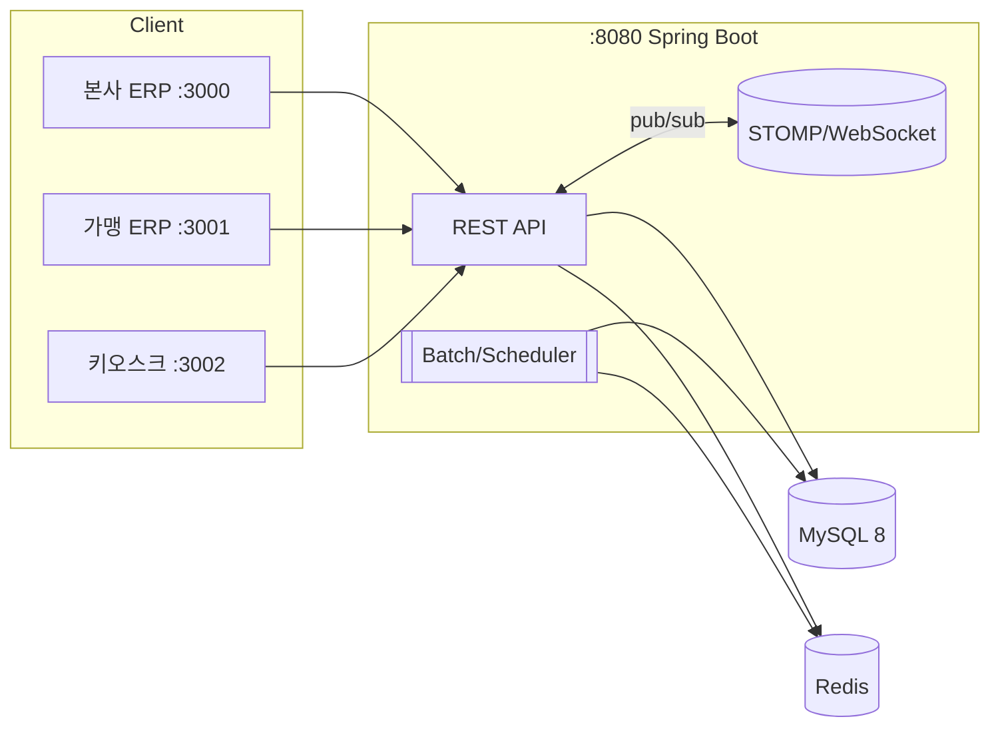

# 📦 ERP System (본사·가맹점·키오스크)

   
  
  
  
  
  

> **개인 프로젝트** | **프론트/백엔드 모두 직접 개발**  
> 멀티 프론트(본사/가맹점/키오스크) + 단일 백엔드 구조  
> WebSocket 알림 · Redis 캐싱 · 배치/아카이브를 통한 운영 성능 최적화

---

## 🧭 목차
- [프로젝트 개요](#-프로젝트-개요)
- [아키텍처](#-아키텍처)
- [포트 구성 & 역할](#-포트-구성--역할)
- [핵심 기능](#-핵심-기능)
- [성능/운영 설계](#-성능운영-설계)
- [ERD](#-erd)

---

## 🎯 프로젝트 개요
프랜차이즈 ERP에서 사용하는 **발주, 주문, 매출 관리**를 본사·가맹점·키오스크로 구분해 **실제 서비스 시나리오**를 반영한 프로젝트입니다.  
- **본사 ERP (React :3000)** : 가맹점 관리, 상품/가격 정책, 본사 매출 대시보드  
- **가맹점 ERP (React :3001)** : 발주/재고 관리, 주문 정산, 매출 리포트  
- **키오스크 (React :3002)** : 고객 주문 UI, 결제 흐름(모의)  
- **백엔드 (Spring Boot :8080)** : 단일 API 서버, 배치/아카이브, WebSocket 알림, Redis 캐싱

---

## 🏗 아키텍처

## 🔌 포트 구성 & 역할
| 서비스 | 포트 | 역할 |
|--------|------|--------------------------------|
| 본사 ERP (React) | 3000 | 가맹/상품/정책 관리, 본사 매출 대시보드 |
| 가맹점 ERP (React) | 3001 | 발주, 재고, 주문 정산 |
| 키오스크 (React) | 3002 | 고객 주문/결제 UI |
| 백엔드 (Spring Boot) | 8080 | REST API, WebSocket, 배치/아카이브, 캐싱 |

## ✨ 핵심 기능
### 본사 ERP
- 가맹점 등록/승인, 상품·가격 정책 배포
- 전국 매출 집계/분석

### 가맹점 ERP
- 일일 발주, 재고/입고 관리
- 주문/결제 처리, 매출 리포트

### 키오스크
- 메뉴·옵션 기반 주문
- 주문 상태 실시간 확인(WebSocket)
- 결제/영수증 모의 구현

## ⚙️ 성능/운영 설계
- **Redis 캐싱**
  - 메뉴, 매출, 주문 등 조회 빈도 높은 데이터 캐싱
  - TTL + 캐시 무효화 전략 적용

- **WebSocket 알림(STOMP)**
  - 주문 상태 변경, 발주 승인 → 실시간 알림

- **배치 처리 & 아카이브**
  - 주문 → 매출 집계 배치 처리
  - 매월 1일, 1년 이상 지난 데이터는 아카이브 스키마로 이동

## 🗃 ERD

  
📊 ERD 보기

  

  - 핵심 테이블: `branches`, `menus`, `orders`, `order_items`,  
    `sales_daily`, `inventory`, `purchase_orders` …

