# 📦 ERP System (본사·가맹점·키오스크)

   
  
  
  
  
  

> **개인 프로젝트** | **프론트/백엔드 모두 직접 개발**  
> 멀티 프론트(본사/가맹점/키오스크) + 단일 백엔드 구조  
> WebSocket 알림 · Redis 캐싱 · 배치/아카이브를 통한 운영 성능 최적화  
> 📥[발표자료 PDF 다운로드](docs/presentation.pdf)

---

## 🧭 목차
- [프로젝트 개요](#-프로젝트-개요)
- [개발 환경](#-개발-환경)
- [아키텍처](#-아키텍처)
- [포트 구성 & 역할](#-포트-구성--역할)
- [핵심 기능](#-핵심-기능)
- [성능/운영 설계](#-성능/운영-설계)
- [ERD](#-erd)
- [구현 화면](#-구현-화면)
- [트러블슈팅 경험](#-트러블슈팅-경험)

---

## 🎯 프로젝트 개요
프랜차이즈 ERP에서 사용하는 **발주, 주문, 매출 관리**를 본사·가맹점·키오스크로 구분해 **실제 서비스 시나리오**를 반영한 프로젝트입니다.  
- **본사 ERP (React :3000)** : 가맹점 관리, 상품/가격 정책, 본사 매출 대시보드  
- **가맹점 ERP (React :3001)** : 발주/재고 관리, 주문 정산, 매출 리포트  
- **키오스크 (React :3002)** : 고객 주문 UI, 결제 흐름(모의)  
- **백엔드 (Spring Boot :8080)** : 단일 API 서버, 배치/아카이브, WebSocket 알림, Redis 캐싱

---

## 🛠 개발 환경
- **Frontend**: React, React Router, Axios, CSS, JS, WebSocket  
- **Backend**: Spring Boot, Spring Security(세션), JPA, MySQL, Redis, Batch Scheduler  
- **Tools**: GitHub, Figma, AWS, Nginx

---

## 🏗 아키텍처
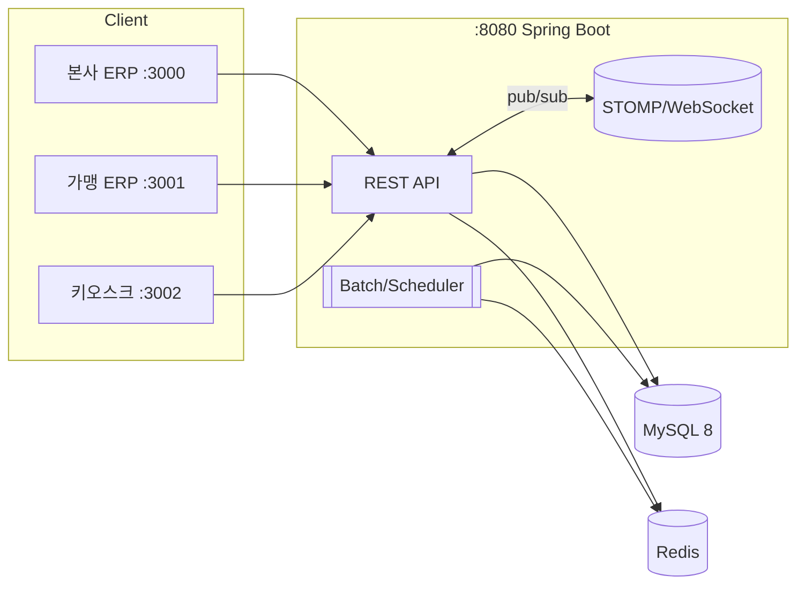
---

## 🔌 포트 구성 & 역할
| 서비스 | 포트 | 역할 |
|--------|------|--------------------------------|
| 본사 ERP (React) | 3000 | 가맹/상품/정책 관리, 본사 매출 대시보드 |
| 가맹점 ERP (React) | 3001 | 발주, 재고, 주문 정산 |
| 키오스크 (React) | 3002 | 고객 주문/결제 UI |
| 백엔드 (Spring Boot) | 8080 | REST API, WebSocket, 배치/아카이브, 캐싱 |

---

## ✨ 핵심 기능
### 본사 ERP
- 가맹점 등록/승인, 상품·가격 정책 배포
- 전국 매출 집계/분석

### 가맹점 ERP
- 일일 발주, 재고/입고 관리
- 주문/결제 처리, 매출 리포트

### 키오스크
- 메뉴·옵션 기반 주문
- 주문 상태 실시간 확인(WebSocket)
- 결제/영수증 모의 구현

---

## ⚙️ 성능/운영 설계
- **Redis 캐싱**
  - 메뉴, 매출, 주문 등 조회 빈도 높은 데이터 캐싱
  - TTL + 캐시 무효화 전략 적용

- **WebSocket 알림(STOMP)**
  - 주문 상태 변경, 발주 승인 → 실시간 알림

- **배치 처리 & 아카이브**
  - 주문 → 매출 집계 배치 처리
  - 매월 1일, 1년 이상 지난 데이터는 아카이브 스키마로 이동

---

## 🗃 ERD

  
📊 ERD 보기

  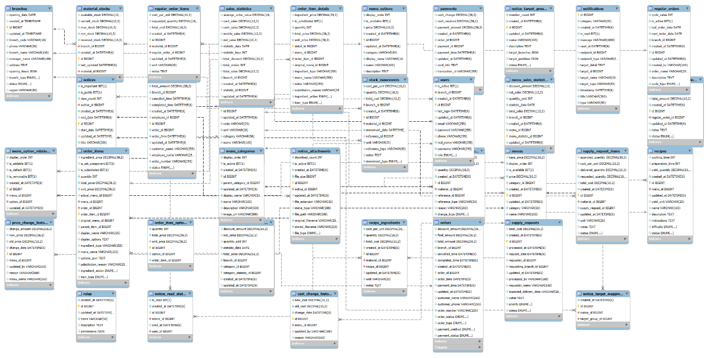

  - 핵심 테이블: `branches`, `menus`, `orders`, `order_items`, `sales_statistics`, `menu_sales_statistics`, `category_sales_statistics` 

---

## 🎥 구현 화면
### 키오스크 화면  
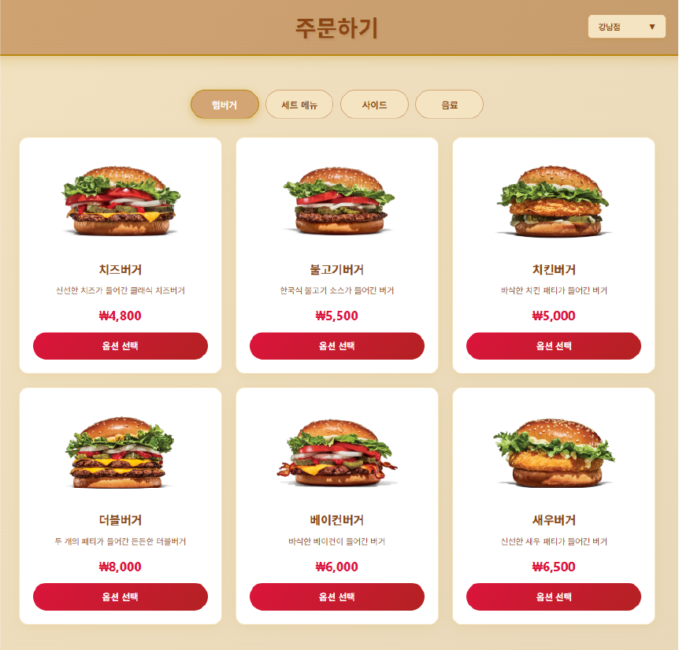
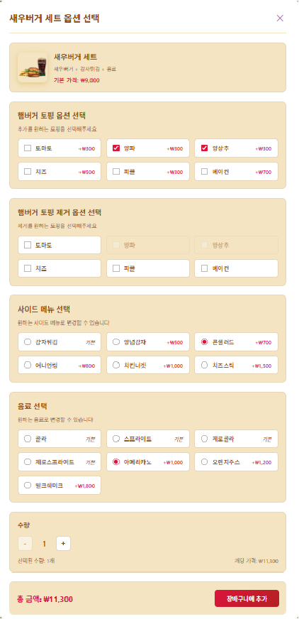
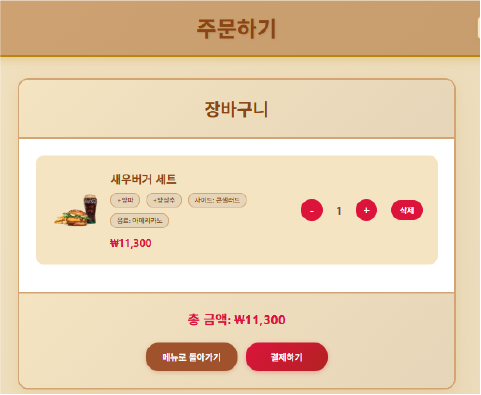

### 본사ERP화면  
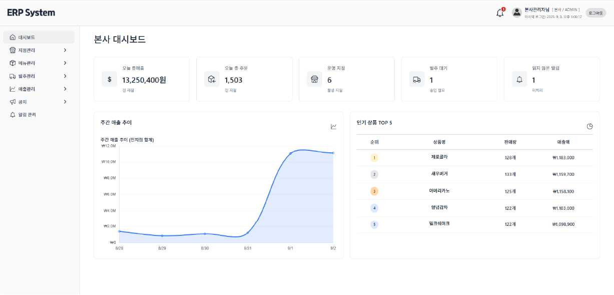
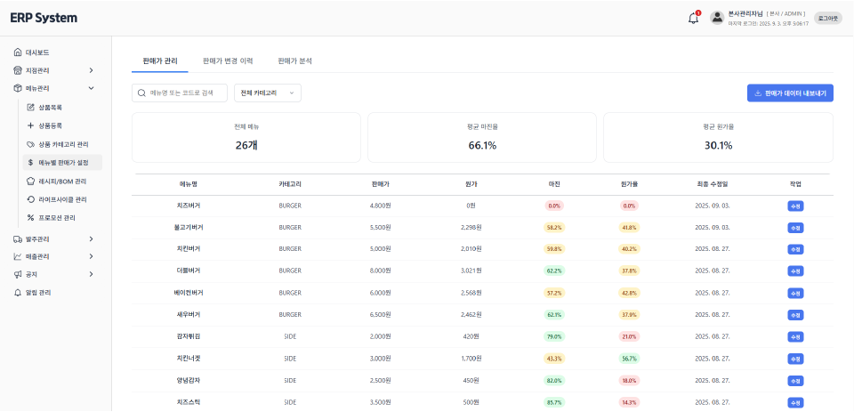
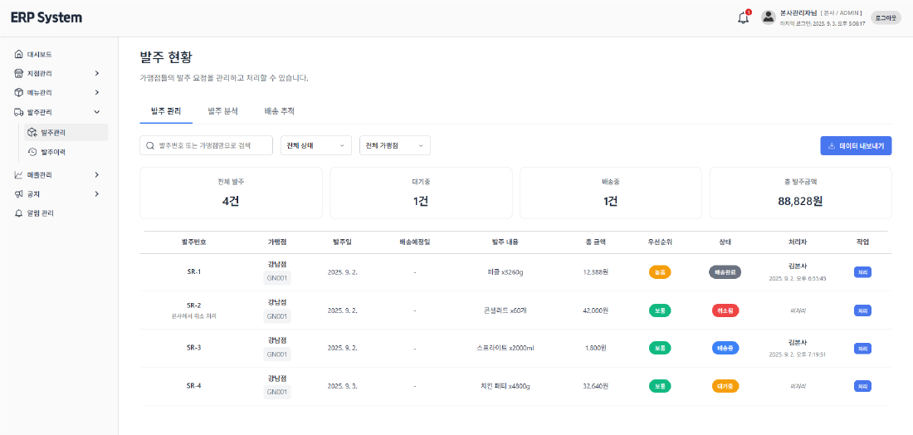

### 가맹점ERP화면  
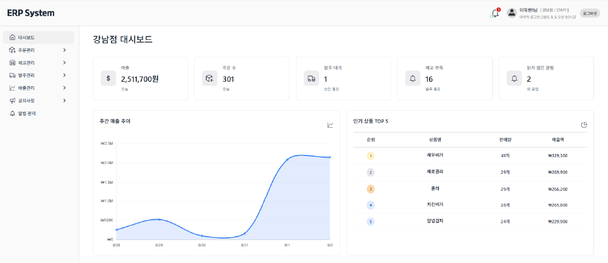
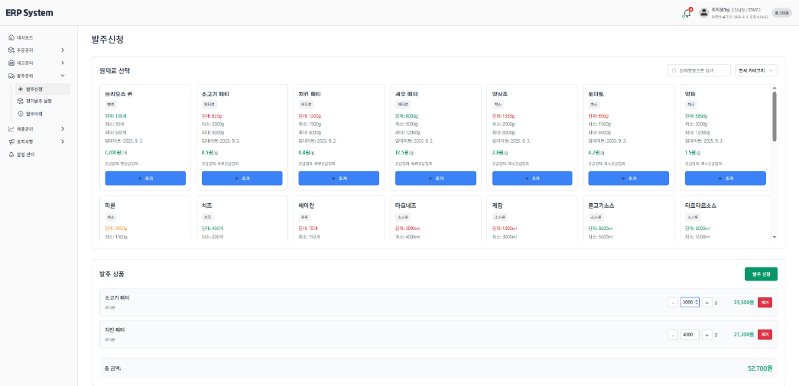
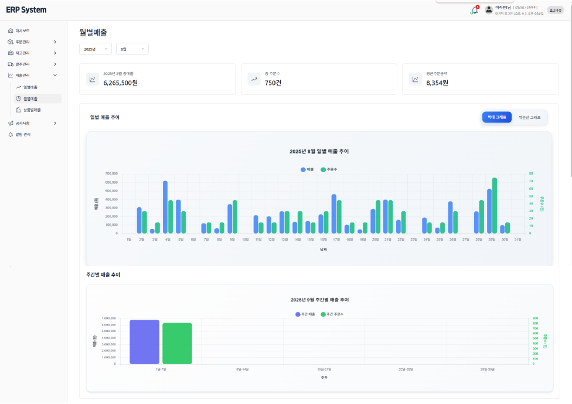

---

## 🧯 트러블슈팅 경험

### 1. WebSocket 연결 불안정 문제
- **문제**
  - 주문 알림(WebSocket) 기능에서 **간헐적으로 알림이 끊기거나 지연** 발생
  - 브라우저 콘솔에 `WebSocket connection failed (code 1006)` 로그 출력
  - 배포 환경에서의 연결 불안정
  - 서버 로그에 세션 종료(disconnect)가 비정상적으로 많이 기록됨
- **원인**
  - **Spring WebSocket heartbeat 미설정** → 중간 네트워크 장비/프록시에서 유휴 연결 정리
  - **프론트엔드 자동 재연결 로직 부재** → 끊기면 수동 새로고침 전까지 알림이 오지 않음
  - **Nginx 기본 설정**에서 WebSocket 타임아웃이 짧아 장시간 연결 유지 불안정
- **해결**
  - **서버(Spring Boot)**: Heartbeat 설정 추가하여 주기적으로 연결 상태 점검
  - **프론트엔드(React)**: 주기적 ping 메시지 전송 + 끊김 감지 시 자동 재연결 로직 구현
  - **Nginx 설정**: WebSocket 업그레이드 및 타임아웃 조정
  - **모니터링 지표 추가**: 연결 끊김 횟수, 평균 재연결 시간, 알림 지연 시간 기록
- **결과**
  - 네트워크 전환/브라우저 백그라운드 이후에도 **자동 재연결** 안정적 동작
  - 알림 누락·지연 발생 빈도 **현저히 감소**
  - 장시간 대기 상태에서도 **연결 유지** 가능
  - 사용자 입장에서 **실시간 알림 경험 개선**

### 2. Redis 캐싱 동기화 문제
- **문제**
  - 메뉴/매출/주문 화면에서 **신규/수정 데이터가 즉시 반영되지 않음**
  - 트래픽 급증 시 **응답 지연**과 **DB 부하 스파이크** 발생
  - 간헐적으로 **동일 키 동시 갱신** 시 데이터가 되돌아가거나 누락되는 사례 확인
- **원인**
  - 캐시 무효화/갱신 전략이 모호 → **DB 변경 후 캐시 충돌**
  - 특정 인기 키에 **동시 접근(캐시 스탬피드)** 발생
  - TTL 부재 또는 과도하게 길어 **오래된 데이터 노출**
- **해결**
  - 핵심 키에 **캐시 무효화 전략(Write-Through + TTL)** 적용
  - DB 변경 시 캐시 갱신, 일정 주기로 자동 만료 처리
- **결과**
  - 캐시 히트율 **상승**, 응답 시간 **단축**
  - **DB 부하 안정화**
  - **데이터 최신성 문제 해결**, UI 반영 속도 개선

### 3. Nginx 배포 설정 문제 (멀티 프론트엔드 서빙)
- **문제**
  - 단일 도메인에 `/hq`, `/branch`, `/kiosk` 서빙 시 **라우팅 충돌/404**
  - SPA 새로고침 시 직접 URL 접근 시 **빈 화면 또는 404**
  - WebSocket 알림이 배포 환경에서만 **불안정**
- **원인**
  - **리버스 프록시 규칙 미정립** → 경로 기반 라우팅 일관성 부족
  - SPA 특성 고려 부족 → `index.html` fallback 미구성
  - WebSocket에 필요한 `Upgrade/Connection` 헤더 및 타임아웃 미설정
  - 프론트 빌드 시 `basename/publicPath` 미지정 → 서브경로 배포 불일치
- **해결**
  - **경로 기반 라우팅 확정**
    - `/hq`, `/branch`, `/kiosk` → 각 빌드 폴더 정적 서빙
    - `/api` → Spring Boot(8080), `/ws` → Spring Boot WebSocket 프록시
  - **SPA fallback 적용**: `try_files ... index.html`
  - **WebSocket 프록시 안정화**: Upgrade/Connection 헤더 및 타임아웃 설정
- **결과**
  - 단일 도메인에서 **3개 프론트 + API/WS**가 충돌 없이 동작
  - 새로고침/직접 진입 404 문제 **해결**
  - WebSocket **안정성 향상**
  - 배포 파이프라인 표준화 → **릴리즈 시간 단축**, 운영 오류율 **감소**
